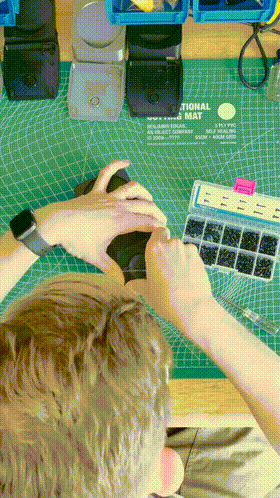

# shoom
a foot-activated webcam to show off your sneakers
 
 
 
 As seen on [TikTok](https://vm.tiktok.com/ZMdTNyktn/)
 
 ## System compatibility
 * Tested on macOS Catalina (10.15)
 * Probably works on Windows too. All the same software and code.
 * Ends Zoom + Google Meet calls (in Google Chrome)
 
 ## What is what?
 * `code.py` is the firmware for the Trinket M0
 * `shoom-base.stl` and `shoom-top.stl` are the 3d print files for the base and the lid. (Also available to edit on Tinkercad [here](https://www.tinkercad.com/things/csqugaID6Sr))
 * `foot-bracket.stl` is directly from Adafruit and is the bracket that will attach the button to the base. It's listed below, but all instructions for assembly are basically identical to [Adafruit's USB Foot Switch controller instructions](https://learn.adafruit.com/USB-foot-switch-circuit-python/asse).
 
 ## Hardware
 ### Supplies
 * [Adafruit Trinket M0](https://www.adafruit.com/product/3500)
 * [A micro-switch](https://www.adafruit.com/product/817)
 * [A Razer Kiyo](https://www.amazon.com/Razer-Kiyo-Streaming-Webcam-Built/dp/B075N1BYWB) (you can use whatever webcam you want, but you'll have to alter the 3d file)
 * some wire, some solder, a soldering iron
 * A 3D printer for parts
 ### Printing/building
 Print the 3D parts and then follow [Adafruit's USB Foot Switch controller instructions](https://learn.adafruit.com/USB-foot-switch-circuit-python/asse) to assemble the pieces. It's the same base here, just with a little webcam spot added to the back. 
 #### With the Kiyo
 You're going to need to remove the bottom base off of the Kiyo. Remove the rubber padding and remove the screws from it to get the base off.
 #### With a different webcam
 If you've decided to use a webcam that's not the Kiyo, you'll have to attach it somehow. 
 
 Either way, run a micro USB cable from the Trinket to your computer and the webcam to your computer as well.
 
 
 
 ## Firmware
 My process for making this work was emulating a keyboard and sending a specific key command (`⌃⌥⌘8` and `⌃⌥⌘9`, probably `CTRL+ALT+WIN+8` and `CTRL+ALT+WIN+9` in Windows) to the computer, which was read and then executed as a hotkey in OBS.
 
 ## Software
 Here's the stuff you'll need on your computer to run this all. 
 
 * [OBS](https://obsproject.com/download), which will run the virtual webcam
 * [OBS Advanced Scene Switcher](https://obsproject.com/forum/resources/advanced-scene-switcher.395/), which does a much better job of switching scenes (from regular webcam to Shoom mode)

Install these two.
 
You'll set up two scenes. One that's "Normal Webcam" and one that's "Shoom."

On the "Normal Webcam" scene, add a Video Capture Device. That's your normal webcam. Center it and fill the screen. This will be the default view you have before you switch into Shoom view.

In the "Shoom" scene, add another Video Capture Device. This time use your secondary (i.e. Razer Kiyo) webcam. Center it and fill the screen. Feel free to add another layer ("Image") and use the Shoom logo supplied here as the `shoom-logo.png` file.

In the Scene Transitions portion of the window, hit the drop down and hit `Add: Slide`.

Name it SlideUp. Make the direction of the animation Up.

Hit the drop down again and hit `Add: Slide` again.

This time, name it SlideDown. Make the direction of the animation—you guessed it—Down.

Now, open `Tools...Advanced Scene Switcher`.

Go to `Macros` and add a new Macro.

Set the IF to If Hotkey
Set the bottom half to Switch scene
Switch scene to Shoom using SlideUp.

Add another new Macro.

Set the IF to If Hotkey
Set the bottom half to Switch scene
Switch scene to Normal Webcam using SlideDown.

Close the window.

Now, finally, go to the OBS Preferences, and then to `Hotkeys`.

By either pressing the buttons on your keyboard or using the Shoom device already plugged in, set them to `⌃⌥⌘8` and `⌃⌥⌘9` (probably `CTRL+ALT+WIN+8` and `CTRL+ALT+WIN+9` in Windows) respectively.

Close that window.

NOW, Start Virtual Camera by pressing the Start Virtual Camera button.

Within your video chat app of choice, change your webcam to `OBS Virtual Camera`

You should be good to go. Use the foot switch to change it back and forth. On Mac, I find I have to have the OBS window active for the hotkeys to work.

 **Enjoy!**
 
##Thank you

Big thank you to [Adafruit](https://adafruit.com) who made the tutorial for the foot switch AND the firmware for it. Almost all the stuff I've built is made using Adafruit parts, they're the very best for creative hacking.
