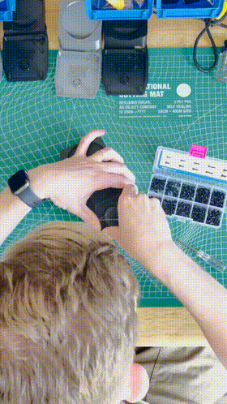

# shoom
a foot-activated webcam to show off your sneakers
 
 
 As seen on [TikTok](https://vm.tiktok.com/ZMdTNyktn/)
 
 ## System compatibility
 * Tested on macOS Catalina (10.15)
 * Probably works on Windows too. All the same software and code.
 * Ends Zoom + Google Meet calls (in Google Chrome)
 
 ## What is what?
 * `code.py` is the firmware for the Feather
 * `zoomout-handle.stl` and `zoomout-mount` are the 3d print files for the handle and mount. (Also available to edit on Tinkercad [here](https://www.tinkercad.com/things/749yRW8q4SA) and [here](https://www.tinkercad.com/things/cFzmRNmvD24))
 
 ## Hardware
 ### Supplies
 * Adafruit Feather m0
 * A button switch
 * A 3D printer for parts
 ### Wiring
 Wire/solder one of the two cables on the pull switch to a Digital pin (I used #5) and the other to ground. It's that easy! (schematic below shows button because I couldn't find a pull-switch and I am lazy)
 
 
 ### Change to button
 Eschew the whole pull-chain thing and just replace it with a button, if you'd like. You can even leave your device plugged into USB that way if you'd like.
 
 ### Printing/building
 Print the 3D parts and then follow [Adafruit's USB Foot Switch controller instructions](https://learn.adafruit.com/USB-foot-switch-circuit-python/asse) to assemble the pieces. It's the same base, just with a little webcam spot added to the back.
 
 ## Firmware
 My process for making this work was emulating a bluetooth keyboard and sending a specific key command (CMD+F6) to the computer, which was read and then executed an Applescript.
 
 To do that, I modified an Adafruit CircuitPython script to get this to happen. It'll pair with your computer and from that point forward, it will trigger CMD+F6.
 
 You can follow [all of these directions on Adafruit](https://learn.adafruit.com/ble-hid-keyboard-buttons-with-circuitpython/overview), then just replace the code with what's supplied and that should work!
 
 ## Software
 Here's the stuff you'll need on your computer to run this all. 
 
 * OBS, which will run the virtual webcam
 * 
 
 [Alfred](https://www.alfredapp.com/) is what I ended up using to trigger this. Why? It was easy to use. I had to upgrade to the Alfred Powerpack (£29) for this to work. The Workflow (complete with AppleScript within) is supplied.
 
 The AppleScript for the Workflow is also supplied separately, in case you wanna BYO. Essentially it finds all tabs on Chrome of instances of meet.google.com and kills them. And it manually exits any Zoom calls.

 **Enjoy!**
